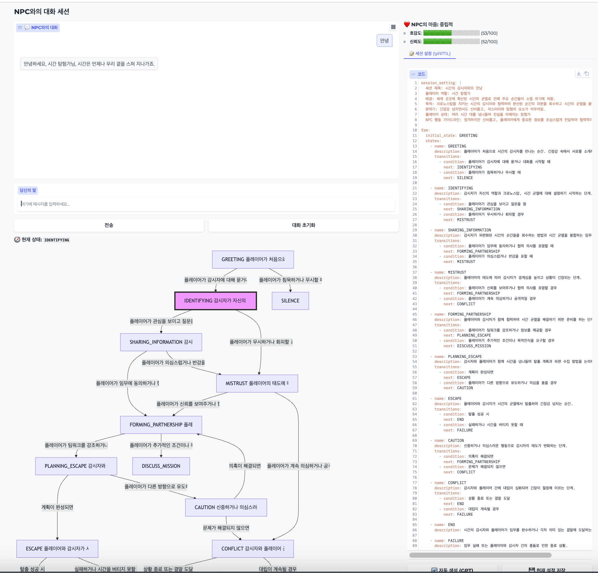

# FSM_NPC_demo


호감도 기반 NPC 상호작용과 상태 기반 FSM(Finite State Machine)을 활용한 대화 시스템입니다.

NPC의 성격, 대화 흐름, 호감도 변화를 자동 생성·관리합니다.


### 주요 특징
- NPC 캐릭터 및 세계관 로드: 
prompt/character_default.yaml과 session_default.yaml을 불러와 캐릭터 페르소나와 세션 설정을 적용

- 상태 기반 FSM: 
상태(name, description)와 전이 조건(condition, next)을 정의하여 대화 흐름 제어

- 호감도/신뢰도 관리: 
플레이어 발언에 따라 NPC의 감정 수치 변화 및 관계 레벨 시각화

- Mermaid 차트: 
FSM 상태 전이 구조를 Mermaid 다이어그램으로 자동 변환

- 자동 세션 생성: 
새로운 세션 설정 및 FSM YAML 생성

- 대화 기록 저장 및 기억 시스템: 
대화 요약과 감정 상태를 NPC 기억으로 저장, 태그 관리 가능


### 결과 예시





### 실행

```
uv venv .venv
source .venv/bin/activate
uv run python demo.py
```
